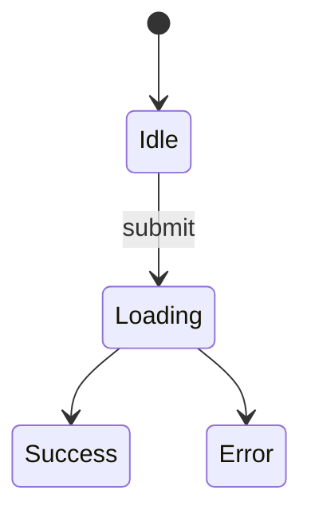

# Spec: <機能名>

## ステータス
- 起票日: YYYY-MM-DD
- 状態: Draft | In Review | Approved | Implemented
- 担当: <名前>
- 関連 Issue/PR: #

## 概要

この機能で何を実現するか、1〜2 段落で。ユーザにとっての価値を明記。

## 動機

なぜ今これを作るのか。`roadmap.md` のどの Phase に対応するか。

## 既存の関連実装

- `packages/core/src/...`
- `apps/web/app/...`
- `docs/specs/<関連 spec>.md`

## データモデル変更

新規テーブル、カラム追加、インデックス、RLS ポリシーの変更を Drizzle スキーマ風に記述。

```ts
// packages/db/src/schema/<table>.ts （案）
```

マイグレーションが破壊的な場合はロールバック手順も記述。

## ドメインロジック

`packages/core` に追加・変更する関数のシグネチャと挙動。

```ts
// packages/core/src/<domain>/<verb>.ts
export function verb(input: Input): Output { ... }
```

エッジケース、エラー条件を箇条書きで。

## API 変更 (tRPC)

```ts
router({
  procedure: publicProcedure.input(...).output(...).query/mutation(...)
})
```

認可ルール、レート制限の必要性。

## UI 変更

画面と状態遷移。可能なら ASCII ワイヤフレームか mermaid 図。



新規コンポーネントは `packages/ui` か `apps/web/components` か明記。

## アクセシビリティ

- キーボード操作
- スクリーンリーダー
- カラーコントラスト（WCAG AA 以上）

## アナリティクス

このフィーチャで計測すべきイベント:
- `<event_name>` { props: ... }

## テスト計画

- [ ] ユニット: `packages/core` の関数
- [ ] 統合: tRPC プロシージャ
- [ ] E2E: Playwright で主要フロー

## ロールアウト

- フィーチャフラグの要否
- 段階リリース（一部ユーザ → 全員）
- 監視項目

## オープンクエスチョン

- [ ] 質問1
- [ ] 質問2

## 不採用案

検討したが採用しなかった代替案と理由（将来同じ議論を繰り返さないため）。
